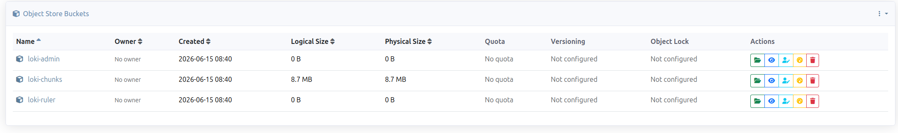

# Loki

[Grafana Loki](https://grafana.com/oss/loki/)

- NOTE: the repo will move new repository [grafana-community/helm-charts](https://github.com/grafana-community/helm-charts/tree/main/charts).

# Add Loki as a data source in Grafana

## 1. find the service
```bash
# loki-gateway   ClusterIP   10.43.188.174   80/TCP
http://loki-gateway.monitoring.svc.cluster.local

# Or simply (since Grafana is in the same namespace):
http://loki-gateway
```


## 2. Add Loki in Grafana

There are two ways to set up Loki as a data source in Grafana:

### Option 1: Via Helm Values (did not worked) 

Set the following in the file  
`[helm_kube_prometheus_stack](../../helm_kube_prometheus_stack/defaults/main.yml)`:

```yaml
grafana_loki_datasource_enabled: true
```

### Option 2: Via Grafana UI

1. Go to: Grafana Datasources
2. Click "Add data source".
3. Select Loki as the type.
4. Enter the URL: `http://loki-gateway.monitoring.svc:80`
5. Save and test the connection.


# Storage for logs
* MiniO: 
* CephRGW: https://github.com/grafana/loki/issues/611
* file system


```bash
# test
kubectl logs -n monitoring -l app.kubernetes.io/name=loki --tail=200 | grep -iE "s3|bucket|chunk|flush|tsdb|error"
```

# make sure you have created these buckets in s3

<div style="text-align: center;">

</div>
